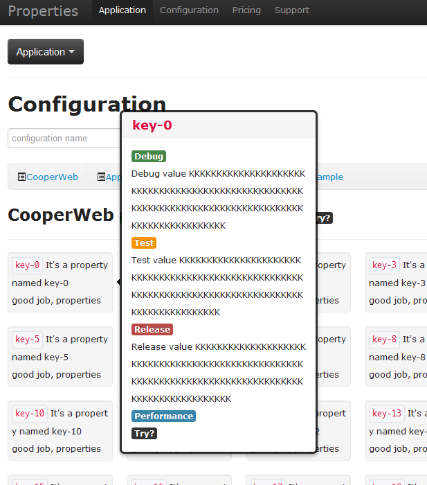

# Properties
==========

properties/configuration/kv management module and system for your app

Cloud service or private deploy

Make configuration easier :)
## Demo

- On AppHarbor
- On Azure

- screenshoots




## Format

- simply
	```xml
	<?xml version="1.0" encoding="utf-8" ?>
	<configuration>
	  <properties>
		<appName>Your App Description</appName>
	  </properties>
	</configuration>
	```

	```json
	{
		"appName":"Your App Description"
	}
	```
	
- Flags

	```xml
	<?xml version="1.0" encoding="utf-8" ?>
	<configuration>
	  <properties>
		<appName description="">
			<debug>Your App Description when debug<debug>
			<test>Your App Description when test<test>
		</appName>
	  </properties>
	</configuration>
	```

	```json
	{
		"appName": { "debug": "Your App Description", "test": "Your App Description" }
	}
	```
## Trace

## Versioned
	
## Security

- X509

## Rest API

- GET

## License

	Copyright 2012 wsky. 
	
	mailto:wskyhx@gmail.com 
	
	follow:@wskyhx

	Licensed under the Apache License, Version 2.0 (the "License");

	you may not use this file except in compliance with the License.

	You may obtain a copy of the License at
 
		 http://www.apache.org/licenses/LICENSE-2.0
 
	Unless required by applicable law or agreed to in writing, 

	software distributed under the License is distributed on an "AS IS" BASIS, WITHOUT WARRANTIES OR CONDITIONS OF ANY KIND, either express or implied.

	See the License for the specific language governing permissions and limitations under the License.